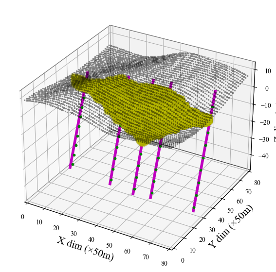
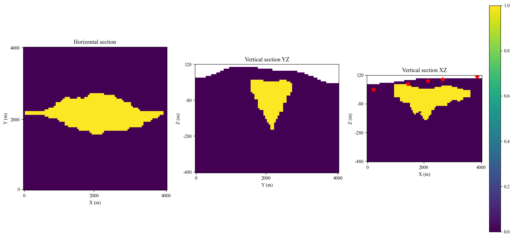
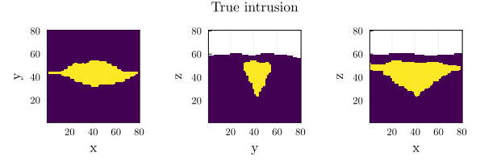
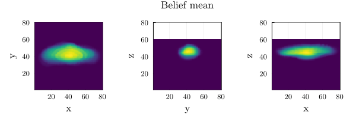
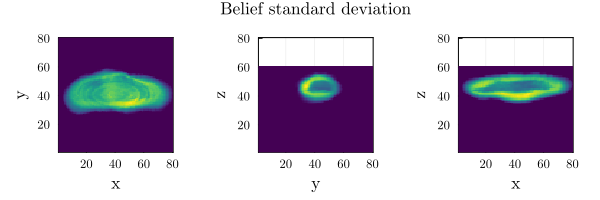
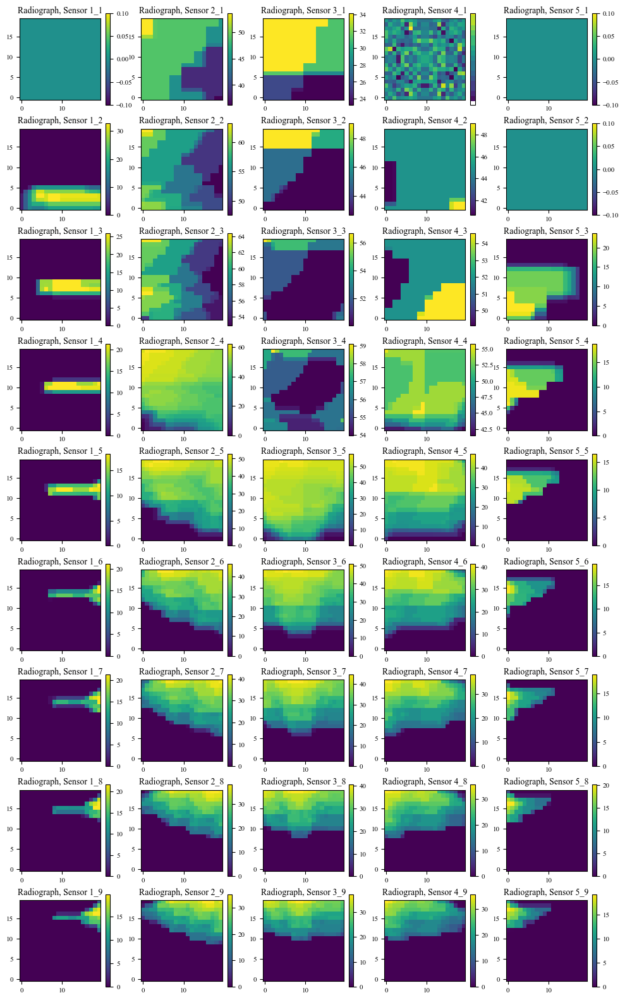

# MuonPOMDPs.jl

Muon tomography modeled as a POMDP using POMDPs.jl

Uses the _inversion variational autoencoder_ (I-VAE) developed for this project ([anonymous-algodev/I-VAE](https://github.com/anonymous-algodev/I-VAE))

See the [`notebooks/i-vae.ipynb`](./notebooks/i-vae.ipynb) notebook for usage.

Drill Locations | Cross Sections
:---------------:|:----:
<kbd>  </kbd> | <kbd>  </kbd>

Belief Updating |
:---------------:|
<kbd>  </kbd>
<kbd>  </kbd>
<kbd>  </kbd>

Radiography |
:---------------:|
<kbd>  </kbd>


## Setup

Install Python dependencies:

```bash
pip install -r python/requirements.txt
``
